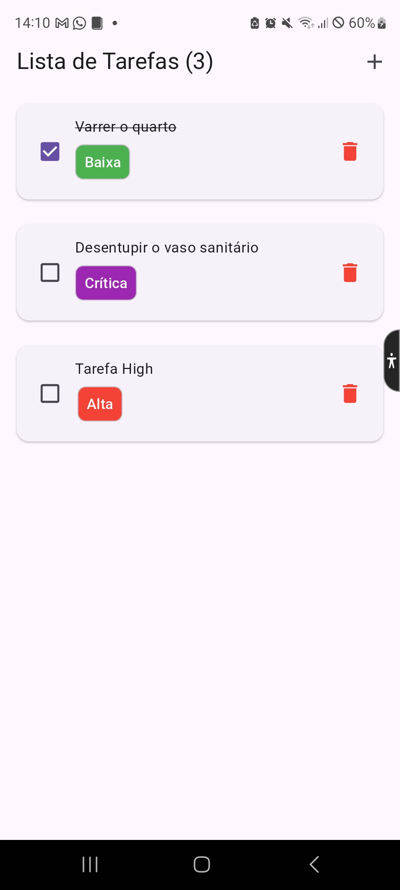
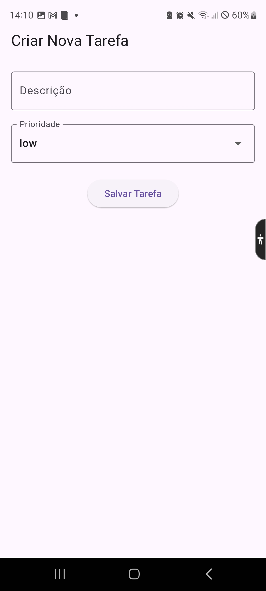

# To-Do List App

[](https://flutter.dev)
[](https://dart.dev)
[](https://opensource.org/licenses/MIT)
<!-- [](https://github.com/seu-usuario/to-do-list-app/actions)
[](https://codecov.io/gh/seu-usuario/to-do-list-app) -->

Um aplicativo simples de lista de tarefas (To-Do List) desenvolvido em Flutter usando a arquitetura **MVP (Model-View-Presenter)**. Este projeto demonstra a separação de responsabilidades entre a lógica de negócios, a interface do usuário e a camada de apresentação.

---

## 📱 Screenshots

| Tela Inicial | Criar Tarefa |
|--------------|------------------|
|  |  |

---

## 🛠️ Funcionalidades

- Adicionar novas tarefas.
- Editar tarefas.
- Marcar tarefas como concluídas.
- Remover tarefas.
- Persistência de dados local (usando `Hive`).

---

## 🏗️ Arquitetura MVP

O projeto segue a arquitetura **MVP (Model-View-Presenter)**:

- **Model**: Gerencia os dados e a lógica de negócios (lista de tarefas).
- **View**: Exibe a interface do usuário e captura interações.
- **Presenter**: Atua como intermediário entre a View e o Model, manipulando a lógica de apresentação.

---

## 📂 Estrutura do Projeto

```tree
lib/
├── model/ # Camada de Model (dados e lógica de negócios)
│ └── task_model.dart
├── view/ # Camada de View (interface do usuário)
│ └── home_page.dart
├── presenter/ # Camada de Presenter (lógica de apresentação)
│ └── task_presenter.dart
├── widget/ # Widgets reutilizáveis
│ └── task_item.dart
└── main.dart # Ponto de entrada do app
```

---

## 🚀 Como Executar o Projeto

**Pré-requisitos**:

- Flutter SDK instalado (versão 3.0 ou superior).
- Um dispositivo físico ou emulador configurado.

**Clone o repositório**:

```bash
  git clone https://github.com/math3ussdl/to_do.git
  cd to_do
```

**Instale as dependências**:

```bash
flutter pub get
```

**Execute o app**:

```bash
flutter run
```

---

## 🧪 Testes

O projeto inclui testes unitários e de widget para garantir a qualidade do código.

**Testes Unitários**:

```bash
flutter test
```

**Testes de um Widget apenas**:

```bash
flutter test test/widget_test.dart
```

---

## 📄 Licença

Este projeto está licenciado sob a licença MIT. Consulte o arquivo [LICENSE](./LICENSE) para mais detalhes.

---

## 👨‍💻 Autor

Feito com ❤️ por [Hugo Lima](https://github.com/math3ussdl).
